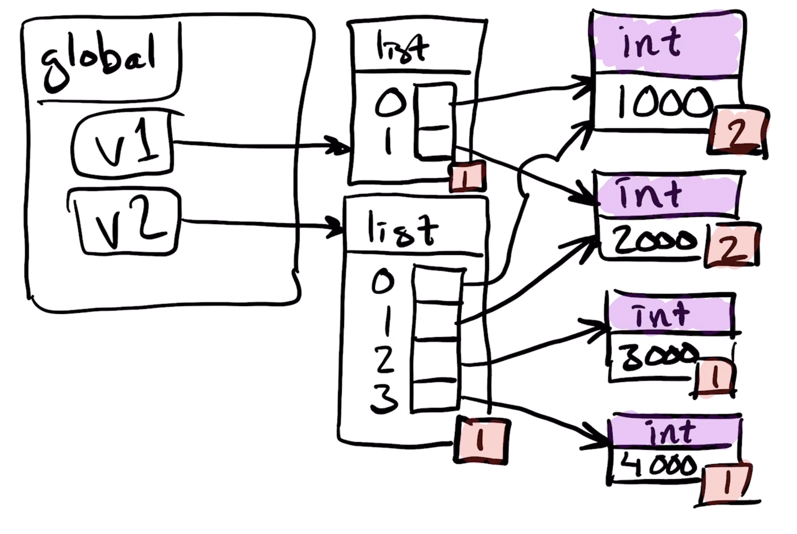
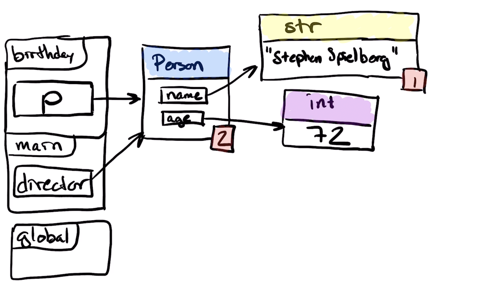

Träningstentan förklarar tentans 7 lärandemål genom exempeltal plockade från gamla tentor.

På samtliga uppgifter med program så förutsätts att det är Python version 3
och inte en äldre version.

# Hårdvara och operativsystem
Lärandemål: beskriva delarna av och terminologin för ett datorsystem översiktligt: CPU, minne, operativsystem och användargränssnitt.

(1)
Namnge den komponent i datorn som utför grundläggande aritmetiska operationer.
```
(A) CPU [RÄTT SVAR]
(B) Operativsystem (Operating System på engelska)
(C) RAM
(D) Användargränssnitt (User Interface)
```
(2)
Vad kallas en komponent med förändringsbart minne som inte utför några beräkningar
utan enbart lagrar resultat och delresultat?
```
(A) CPU
(B) Operativsystem (Operating System på engelska)
(C) RAM [RÄTT SVAR]
(D) Användargränssnitt (User Interface)
```
(3)
Vilket av dessa är inte ett operativsystem?
```
(A) Android.
(B) Atom. [RÄTT SVAR]
(C) Linux.
(D) iOS.
(E) MacOSX.
(F) Windows.
```
(4)
Vilken av dessa ingår normalt sett inte i ett användargränssnitt?
```
Drivrutiner [RÄTT SVAR]
Fönster
Knappar
Menyer
Scrollbars
```
(5)
Namnge denna klassiska modell av datorn.

[RÄTT SVAR] Von Neumann-arkitekturen
# Beskriva källkod
Lärandemål: beskriva källkoden till ett dataprogram med rätt terminologi.

(6)
Dessa symboler:
```
&   |   +   <   ==
```
är exempel på något som i Python3 kallas för:
```
(A) identifierare (identifier på engelska)
(B) avgränsare (delimiter)
(C) operatorer (operators) [RÄTT SVAR]
(D) litteraler (literals)
(E) nyckelord (keywords)
```

(7)
Endast en av dessa är ett uttryck. Vilken?
```
(A)
i = 23
if a < 200:
    print("Finklädsel!")
(B) [RÄTT SVAR]
n_bananas*23 + 100
(C)
for i in range(10):
    print(i)
(D)
n_coconuts = 17*4711 + 1673
(E)
while CURRENT_YEAR == 1066:
    print("Thou shalt proceed with haste!")
```

(8)
```
input
```
...är ett exempel på...
```
(A) identifierare (identifier på engelska) [RÄTT SVAR]
(B) avgränsare (delimiter)
(C) operator (operator)
(D) litteraler (literal)
(E) nyckelord (keyword)
```

(9)
```
:
```
...är ett exempel på...
```
(A) identifierare (identifier på engelska)
(B) avgränsare (delimiter) [RÄTT SVAR]
(C) operator (operator)
(D) litteral (literal)
(E) nyckelord (keyword)
```

(10)
Vilken av följande definierar begreppet syntax?
```
(A) Ett program som översätter pythonkod till assembler.
(B) Regler för hur symboler får kombineras till ett program. [RÄTT SVAR]
(C) Den mest effektiva lösningen på ett programmeringsproblem.
(D) Kopplingen mellan namnet på någonting och dess betydelse.
```
# Datatyper
Lärandemålet: beskriva och tillämpa grundläggande datatyper, klasser och typkonverteringar.
(11)
Vilken datatyp får a?
```
a = 13.0
```
```
bool
complex
float [RÄTT SVAR]
int
NoneType
str
Ingen alls. Det blir syntaxfel.
```
(12)
Vilken datatyp får b?
```
a = 13.0
b = 2 + a
```
```
bool
complex
float [RÄTT SVAR]
int
NoneType
str
Ingen alls. Det blir syntaxfel.
```
(13)
Vilken datatyp får ai?
```
class AI:
    pass


ai = AI()
```
```
(A) AI [RÄTT SVAR]
(B) class
(C) type
```
(14)
Vilket fel inträffar om man försöker addera en sträng med en int som i följande
exempel:
```
13 + "foobar"
```
```
AttributeError
SyntaxError
TypeError [RÄTT SVAR]
ZeroDivisionError
```
(15)
Vilken av dessa är INTE en datatyp?
```
(A) int
(B) bool
(C) str
(D) print [RÄTT SVAR]
(E) complex
(F) float
```
# Uttryck och flödeskontroll
Lärandemålet: beskriva, tillämpa och felsöka flödeskontroll samt logiska och aritmetiska uttryck.

(16)
Byt ut kommentaren i koden nedan mot ett svarsalternativ i taget. Vilket/vilka alternativ får detta Python3-program att exekvera raden med print?
```
def main():
    # Här ska svaret stoppas in i koden.
    if ( not a or b) and (not b or c):
        print(a,b,c)


main()
```
```
(A) a, b, c = True, True, True [RÄTT SVAR]
(B) a, b, c = True, True, False
(C) a, b, c = True, False, True
(D) a, b, c = True, False, False
(E) a, b, c = False, True, True [RÄTT SVAR]
(F) a, b, c = False, True, False
(G) a, b, c = False, False, True [RÄTT SVAR]
(H) a, b, c = False, False, False [RÄTT SVAR]
(I) Inget av ovanstående alternativ.
```

(17)
Tre variabler; a, b och c pekar var och en på antingen True eller False. Ge a, b och c värden som gör att det logiska uttrycket nedan blir True. Om det finns flera lösningar så räcker en av dem (vilken som helst) för full poäng. Parenteserna kring not-uttrycken behövs inte tekniskt sett, men de gör uttrycket lättare att läsa.
```
(a or (not b)) and (b or (not c)) and ((not b) or (not c)) \
and ((not a) or b) and (a or b)
```
Vi testar i iPython, men på tentan får det göras manuellt:
```
In [14]: for a in [True, False]:
   ....:     for b in [True, False]:
   ....:         for c in [True, False]:
   ....:             if (a or (not b)) and (b or (not c)) and ((not b) or (not c)) \
   ....:             and ((not a) or b) and (a or b):
   ....:                 print("a =", a, "b =", b, "c =", c)
   ....:                 
('a =', True, 'b =', True, 'c =', False) [RÄTT SVAR]
```
(18)
Vad skriver nedanstående program ut?
```
dygder = ["rättvisa", "klokhet", "tapperhet", "måttfullhet"]
print(dygder[1], dygder[-1])
```

```
SVAR:
('klokhet', 'måttfullhet')
```

(19)
Vad skrivs ut av följande satser:

```python
argos = 0
while argos <= 20:
    print(argos, end=" ")
    argos += 7
```
```
1. 0 7 14 [RÄTT SVAR]
2. 0 7 14 20
3. 0 7 14 21
4. 7 14 21
5. Inget av ovanstående
```
(20)
Vad/vilka fel finns i följande if-sats?
```
if argonauter == 50:
    print "De var 50"
```
```
1. Ett kolon saknas efter print
2. == borde vara =
3. Den saknar villkor
4. Man kan inte skriva ut 50
5. Inget av ovanstående [RÄTT SVAR]
```
# Räckvidd och livslängd
Lärandemålet: beskriva en variabels räckvidd och livslängd.
(21)
```
def mystery(a, b):
    a, b = b, a
    print(a, b, end = " ")


def main():
    a, b = 42,13
    mystery(a, b)
    print(a, b)


main()
```
```
(A) 13 42 13 42
(B) 13 13 13 13
(C) 42 42 42 42
(D) 13 42 42 13 [RÄTT SVAR]
(E) 42 13 13 42
(F) 42 13 42 13
```
(19) Vad skriver detta program ut?
```
def mystery(dygder):
    dygder[1] = dygder[2]

def main():
    dygder = ["rättvisa", "tapperhet", "klokhet", "måttfullhet"]
    mystery(dygder)
    for x in dygder:
        print(x, end="")
    print()


main()
```
```
(A) tapperhet rättvisa klokhet måttfullhet
(B) tapperhet tapperhet klokhet måttfullhet
(C) rättvisa klokhet tapperhet måttfullhet
(D) rättvisa klokhet klokhet måttfullhet
(E) klokhet måttfullhet rättvisa tapperhet
```
(20)
Vad skriver följande Python3-program ut?
```
def mystery(name):
    name += " " + "Yousafzai"
    print(name, end=" ")


def main():
    name = "Malala"
    mystery(name)
    print(name)


main()
```
```
(A) Malala Yousafzai Malala [RÄTT SVAR]
(B) Malala Yousafzai Malala Yousafzai
(C) Yousafzai Malala
(D) Malala Yousafzai
(E) Malala Yousafzai Yousafzai
```

Vad skriver programmet nedan ut?
```
def mystery(name):
    name += " Blomgren"

def main():
    name = "Nicole"
    mystery(name)
    print(name)


main()
```

Programmet skriver ut:
```
Nicole
```
# Lådor och pilar
Lärandemål: grafiskt beskriva kopplingen mellan variabelnamn, typer och data.
På var och en av nedanstående uppgifter behöver du rita en bild över minnet
vid en viss position under programmets körning. Du behöver ha med:
1. Lådor för globala och lokala variabler.
2. Se till att pilarna har spetsar och inte bara är streck.
3. Referensräkning för alla lådor som är utpekade av pilar, utom heltal n där
-5 <= n <= 256 samt objekten None, True och False.
4. Ta med alla objekt som har existerat under programmets körning. Om det är
möjligt att skräpsamlaren (the garbage colllector) har tagit bort det, låt det
stå kvar men rita en pil från skräpsamlaren till objektet som ska tas bort och uppdatera referensräkningen från objekt som pekas ut av det snart döda objektet.
(26)
Rita ett låd och pildiagram när programmet når den kommenterade raden:
```
v1 = [1, 2]
v2 = v1 + [3, 4]
# Den kommenterade raden
```

(27)
Rita ett låd- och pildiagram över minnet efter att följande rad har körts:
```
first = destroy_element(first, 2)
```
...i programmet nedan:
```python
class Node:
    def __init__(self, value, following):
        self.value = value
        self.following = following


def print_values(first):
    temp = first
    while temp:
        print(temp.value)
        temp = temp.following


def create_list(size):
    first = Node(size, None)
    for i in range(size-1, 0, -1):
        first = Node(i, first)
    return first


def destroy_element(first, index):
    """returns the first element where index has been destroyed"""
    if index == 0:
        return first.following
    answer = first #we will change this variable
    for i in range(index-1):
        first = first.following
    following_following = first.following.following
    first.following = following_following
    return answer


def main():
    first = create_list(4)
    print_values(first)
    first = destroy_element(first, 2)
    print_values(first)


if __name__ == '__main__':
    main()
```
[Facit med bild](https://github.com/dicander/box_arrow_diagram/blob/master/facit.md )
(28)
Rita en minnesbild med låd- och pildiagram för hur det ser ut i minnet då körningen når den kommenterade raden. Om flera lådor ligger i samma scope (scope kallas ibland räckvidd på svenska), rita dem i samma rektangel/rektanglar.
```
class Person:
    """A person with name and age."""
    def __init__(self, name, age):
        self.name = name
        self.age = age


    def birthday(p):
        p.age += 1
        # Låd- och pildiagram här.


    def main():
        director = Person("Stephen Spielberg", 71)
        birthday(director)


main()
```

(29)
Rita en minnesbild med låd och pildiagram för hur det ser ut när allt innan den kommenterade raden har körts.
```
happy = 2018
new = happy
year = new
happy += 1
# Låd- och pildiagram här.
```
(30)
Rita en minnesbild med låd- och pildiagram för hur det ser ut då körningen når den kommenterade raden.
```
class Item:
    """A singly linked list."""
    def __init__(self, value=None, next=None):
        self.value = value
        self.next = next


    def main():
        first = Item()
        first.next = Item()
        first.next.next = Item()
        first.next = first.next.next
        # Rita hur minnet ser ut här


main()
```


# Rekursion
Lärandemål: Felsöka, och med rätt terminologi beskriva rekursiva algoritmer.

(31)
Vilket/Vilka alternativ beskriver vad detta Python3-program gör?
```
def mystery():
    mystery()
    print("Rekursion")


mystery()
```

(A) Det skriver “Rekursion” exakt en gång.
(B) Raden med print körs inte en enda gång. [RÄTT SVAR]
(C) Det skriver “Rekursion” om och om igen tills någon slår av det.
(D) Det kraschar. [RÄTT SVAR]
(E) Det skriver “Rekursion” färre än 100 gånger och avslutas sedan utan att krascha.
(F) Inget av ovanstående alternativ.

(32)
Vilket/vilka påståenden om rekursioner stämmer?
```
(A) Det finns alltid ett och bara ett basfall för en rekursion.
(B) Den del av koden som utgör ett basfall innehåller oftast ett eller flera rekursiva anrop.
(C) Ett rekursivt anrop bör ha andra argument än de argument som funktionen anropades med. [RÄTT SVAR]
(D) Om bara argumenten till det rekursiva anropet är annorlunda än de argument som funktionen anropades med så kommer rekursionen till sist att avslutas utan att det blir recursion error.
```
(33)
Vad skriver följande program ut?
```
def mystery(n):
    if n <= 0:
        return 1
    return mystery(n-1)+mystery(n-2)


print(mystery(3))
```
```
1. 1
2. 2
3. 3
4. 4
5. 5 [RÄTT SVAR]
6. 6
7. 7
8. 8
9. 9
10. Inget av ovanstående alternativ
```
(34)
Vad skriver följande program ut?
```
def mystery(n):
    if n <= 0:
        return 1
    else:
        return n*mystery(n-1)

print(mystery(3))
```
```
1. 1
2. 2
3. 3
4. 4
5. 5
6. 6 [RÄTT SVAR]
7. 7
8. 8
9. 9
10. Inget av ovanstående alternativ
```
(35)
I föregående uppgift. Vad kallas denna bit av koden:
```
    else:
        return n*mystery(n-1)
```
```
(A) Basfall
(B) Funktionsdeklaration
(C) Grundfall
(D) Rekursivt fall [RÄTT SVAR]
(E) Slutfall
```
